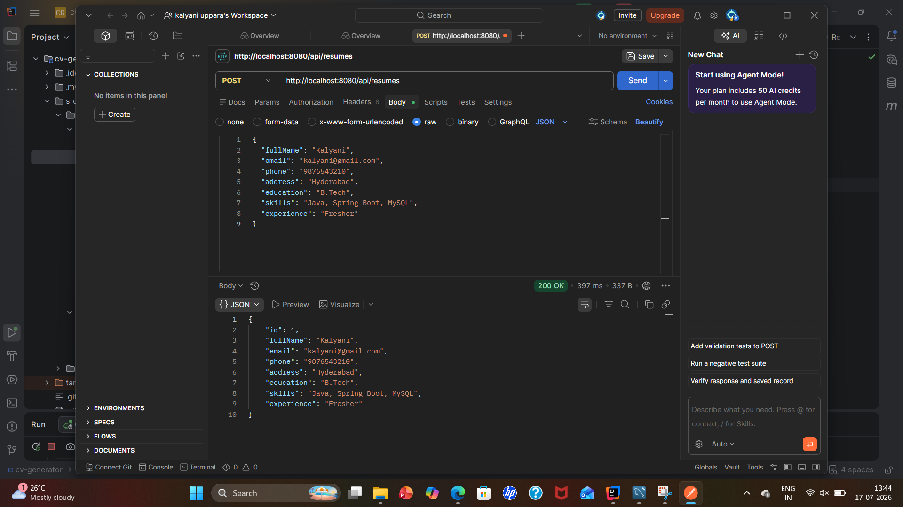
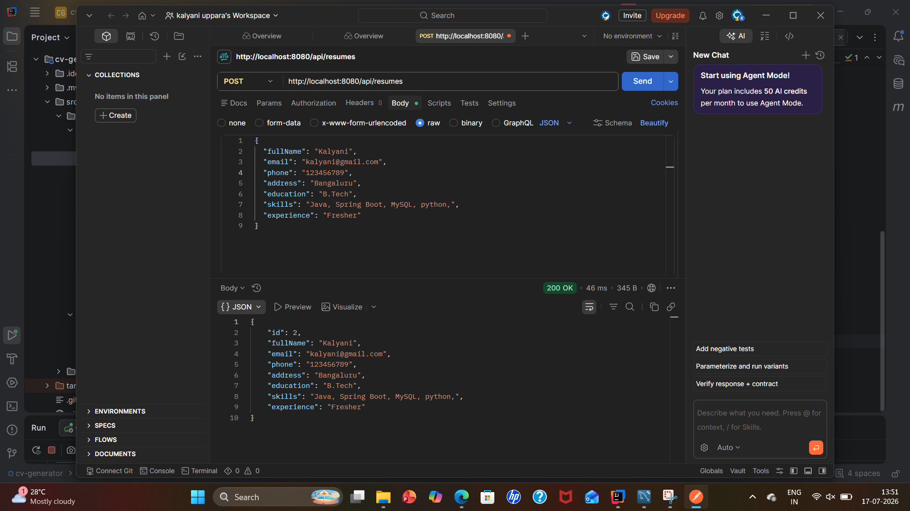
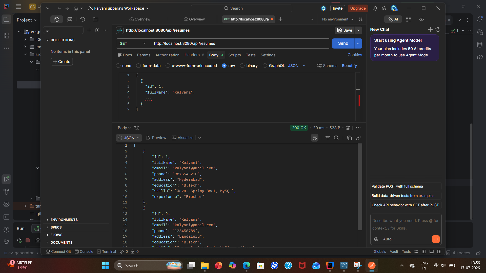
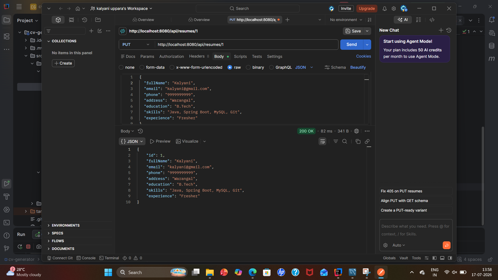
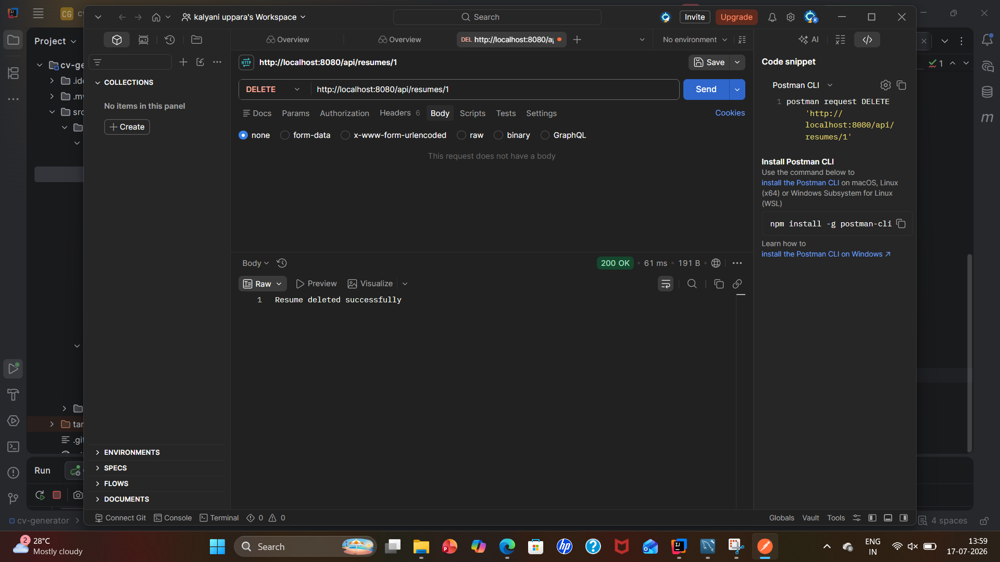

# CV Generator - Spring Boot

## Project Overview

CV Generator is a Spring Boot based REST API application used to create, retrieve, update, and delete resume information.

This project provides CRUD operations for managing resume details.

---

## Technologies Used

- Java 21
- Spring Boot
- Spring Web
- Spring Data JPA
- MySQL
- Maven
- IntelliJ IDEA
- Git & GitHub

---

## Project Structure

```
controller  - Handles REST API requests
service     - Contains business logic
repository  - Database operations
entity      - Database models
dto         - Data transfer objects
exception   - Global exception handling
```

---

## Features

- Create Resume
- Get All Resumes
- Get Resume By ID
- Update Resume
- Delete Resume
- Exception Handling

---

## API Endpoints

### Create Resume

```
POST /api/resumes
```

### Get All Resumes

```
GET /api/resumes
```

### Get Resume By ID

```
GET /api/resumes/{id}
```

### Update Resume

```
PUT /api/resumes/{id}
```

### Delete Resume

```
DELETE /api/resumes/{id}
```

---

## Screenshots

### Create Resume API




### Get All Resume API




### Get Resume By ID API




### Update Resume API




### Delete Resume API



---

## How to Run

1. Clone the repository

```
git clone https://github.com/upparakalyani289-star/cv-generator-springboot.git
```

2. Open project in IntelliJ IDEA

3. Configure MySQL database in:

```
application.properties
```

4. Run Spring Boot application

---

## Author

Kalyani
